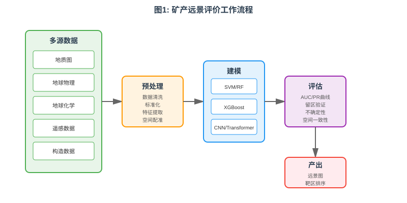
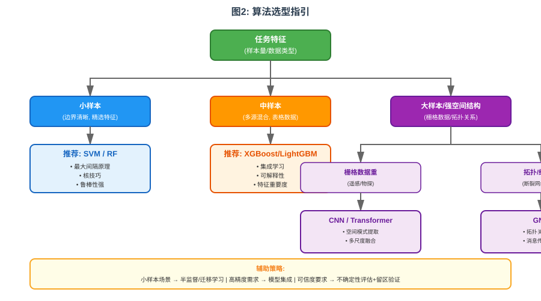
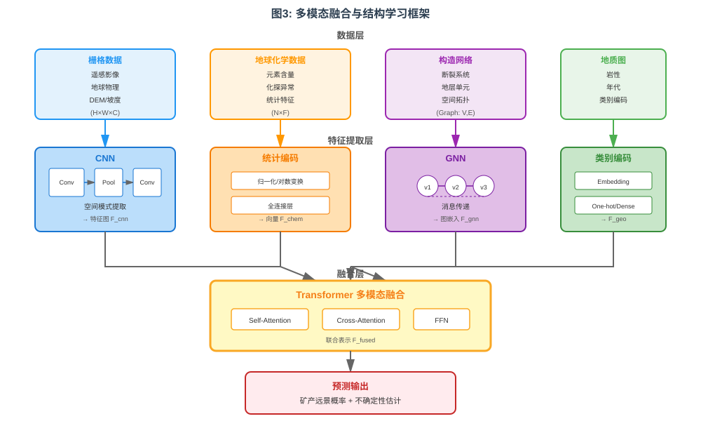
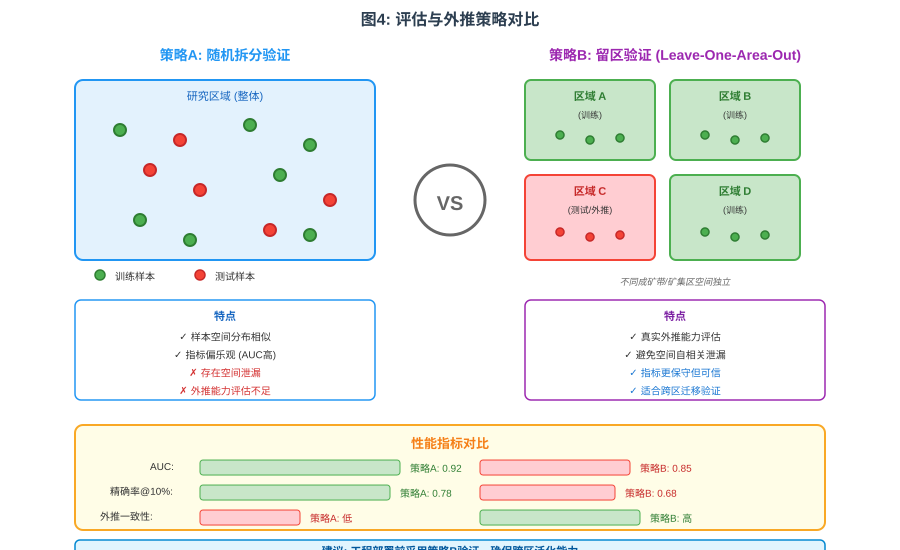

# 题目：机器学习算法在地质数据分类与预测中的应用进展：以矿产远景评价为例

## 摘要
矿产远景评价（Mineral Prospectivity Mapping，MPM）通过融合地质、地球物理、地球化学与遥感等多源证据，对潜在矿化靶区进行空间预测与排序。近五年，机器学习（ML）与深度学习（DL）在 MPM 中的应用快速演进：一方面，支持向量机（SVM）与随机森林/梯度提升（RF/XGBoost/LightGBM）成为多源融合与工程落地的主力；另一方面，卷积神经网络（CNN）、Transformer 与图神经网络（GNN）面向强空间结构与多模态数据展现精度与表达优势。同时，半/自监督学习、知识—数据协同与不确定性建模提升了小样本、弱标注与跨区外推的可靠性。本文系统梳理 MPM 数据与任务范式，比较 SVM、RF/Boosting、深度网络与 GNN 的优势、局限与适用场景，汇总近年矿种与区域的代表性研究进展，并提出评估与工程化建议：小样本与边界清晰任务优先 SVM/RF；中等规模、多源混合任务优先 XGBoost/LightGBM+集成；大样本与强空间结构任务优先 CNN/Transformer/GNN，辅以半/自监督与知识约束；全流程建议采用留区验证与不确定性评估，确保外推可信。上述结论可为地勘机构与矿业企业搭建可复用、可迁移、可量化风险的智能找矿工作流提供参考。[1–20]

**关键词**：矿产远景评价；机器学习；支持向量机；随机森林；XGBoost；卷积神经网络；Transformer；图神经网络；半监督学习；多源数据融合

---

## 1 引言
矿产勘查决策依赖多源异构数据（地质、构造、地化、物探、遥感）与专家先验。传统证据权重与多准则决策在主观赋权、特征交互刻画与跨区泛化方面存在局限。机器学习可通过非线性建模与特征学习自动挖掘控矿因子组合，结合不确定性评估提升靶区优选的可信度。近五年，MPM 方法主要沿三条路径演化：（1）RF/XGBoost 等集成学习成为表格/栅格混合要素融合与可解释沟通的工程标准[4–9]；（2）CNN/Transformer 支持端到端从遥感和物探栅格中学习跨尺度模式[2,3,10,11]；（3）GNN 显式建模断裂-地层-地化的非欧几里得拓扑关系，强化构造控矿表达与外推能力[17–19]。配合半/自监督、知识—数据协同与不确定性建模，MPM 逐步由“经验驱动”迈向“数据-知识协同驱动”的可信智能找矿[1–3,12,19,20]。

## 2 数据特征与任务范式
### 2.1 数据特征
- 多源异构与多尺度：地质图（类目/矢量）、断裂网络（拓扑/几何）、地化点样（稀疏/异方差）、物探与遥感栅格（多波段/不同分辨率）并存，空间自相关强、分布非平稳。
- 标注稀缺与极不均衡：已知矿点数量有限且空间聚簇；“非矿化”定义易引入噪声与虚假负样本。
- 先验重要：成矿体系、控矿要素与构造演化等知识对特征工程与验证至关重要。

### 2.2 任务类型与评价
- 分类/排序：像元或单元格前景概率/等级（AUC、PR、命中率-覆盖率曲线）。
- 异常/单类识别：在负样本不可得时开展一类学习（OCSVM、单类 GNN）。
- 区域外推：跨矿区/成矿带时的留区验证（leave-one-area-out）与时间滚动检验。
- 可信评估：除点指标外，重视空间一致性、地质一致性与不确定性地图[1,7,12,16,19]。

## 3 支持向量机（SVM）：小样本与非线性边界的稳健基线
**优势**：最大间隔原理与核技巧使其在中等维度、边界相对清晰且样本有限时具备稳健性；结合精心设计的证据层（断裂距离、蚀变指数、地化异常强度、岩性编码等）常取得较高命中率与较好的覆盖-精度平衡[14,15]。

**局限**：核与超参数（C、γ）敏感，多分类依赖一对一/一对多策略；难以直接表达复杂空间交互；概率输出需校准。

**适用策略**：RBF 核+交叉验证/贝叶斯优化；类不平衡用类权重/阈值移动/SMOTE；负样本缺失时采用 OCSVM 或半监督 S3VM[16]。

**进展**：区域尺度 SVM 结合改进 MCDM 可降低主观不确定性并在金、铜等矿种获得较高 AUC[14]；GA-SVM 支持自动变量筛选与调参，提升一致性[15]。

## 4 随机森林与梯度提升（RF/XGBoost/LightGBM）：工程落地主力
**优势**：对异构特征与异常值鲁棒、能处理缺失；变量重要度与（可选的）SHAP 有助于要素甄别与沟通；在金/铜/铅锌/锂等矿种与多地区的区域预测中表现稳定[4–9]。

**局限**：RF 捕捉强空间结构的能力有限；Boosting 对噪声更敏感，需要正则化与交叉验证；解释性优于深度模型但对“因果-空间交互”仍需补强。

**适用策略**：
- 特征工程：邻近度/密度核化、地化异常多尺度统计、构造方向性特征；
- 评估：分层抽样、时空拆分与留区验证，避免空间泄漏；
- 不均衡：阈值移动、成本敏感与分位数损失；
- 融合：Stacking/Voting 提升稳健性与外推一致性。

**进展**：RF/XGBoost 在地球物理与岩石物性校准、金矿区域预测中提升 AUC 与空间一致性[4–6]；XGBoost/LightGBM 在大规模要素与复杂非线性下具优势[5,8,9]。

## 5 深度学习：CNN/Transformer 与图神经网络（GNN）
### 5.1 CNN 与 Transformer：多模态端到端表征
- CNN 擅长局部空间模式提取，适合遥感/物探栅格；Transformer 凭自注意力捕捉长程依赖，利于跨尺度融合（遥感+地化+地质）[2,3,10,11]。
- 进展：Transformer–GCN 融合显著提升复杂成矿区定位精度；多模型集成在多源融合方面优于单一模型[10,11]。
- 局限：数据与算力需求高、对分布漂移敏感；对策为自/半监督预训练、迁移学习、数据增强与留区验证[2,3,11–13]。

### 5.2 图神经网络（GNN）：显式建模构造拓扑与非欧空间
- 思想：将断裂、地化点、地层单元构图，按空间邻近、走向一致或构造连接建立边，通过消息传递学习拓扑—属性耦合[17–19]。
- 进展：GAT/GCN/Graph Transformer 在多矿种/多区域较 CNN 与传统集成学习取得显著提升，并通过知识约束（如距离惩罚、语义图谱）增强地质一致性[17–19,20]。
- 难点与对策：构图规则与图稀疏性影响稳定性；采用 KNN+地质先验联合构图与多尺度层次消息传递可提升鲁棒性[17–19]。

## 6 半/自监督、知识—数据协同与不确定性
- 半监督：S3VM、伪标签与一致性训练在矿点稀缺场景提升外推与小目标识别[16,13]。
- 自监督与迁移：跨区域/跨矿种表征复用显著降低标注成本[2,11,13]。
- 知识—数据协同：以知识图谱、规则约束或物理一致性损失嵌入模型，提高可信度与泛化[19,20]。
- 不确定性：证据深度学习/Dirichlet 不确定性结合空间验证支持风险感知的资源配置[12]。（按要求不展示解释性示例图）

## 7 方法比较与选型建议
- 小样本+精选证据层：SVM/RF 为强基线，辅以 GA 调参与阈值优化，适合普查与快速圈定[14,15]。
- 中样本+多源混合：XGBoost/LightGBM+集成，配合分层/留区验证与阈值移动，适合区域部署[4–6,8,9]。
- 大样本+强空间结构：CNN/Transformer/GNN 端到端学习，适合重点矿集区；建议自/半监督+知识约束并行[2,3,10,11,17–19]。
- 评估：除 AUC/PR 外，重视命中率-覆盖率、空间一致性与留区外推；过程留痕便于复现与沟通。

## 8 代表性进展与趋势
- 集成学习为工程主力：RF/XGBoost 以较低调参成本实现稳健收益，并在地球物理—物性校准与多源融合中提升可靠性[4–6,8]。
- 深度与图模型的表达优势：Transformer—GCN/GNN 在复杂地质背景下呈现更高的空间聚焦性与一致性，是精细化圈定的优选[10,11,17–19]。
- 知识引导提升可用性：知识—数据协同降低黑箱性与外推风险，有助于跨区迁移与组织级知识复用[19,20]。
- 样本与标注瓶颈缓解：半/自监督在多地取得正面结果，值得在早期普查阶段优先采用[13,16]。
- 可信 AI：不确定性与多目标（精度—成本—风险）协同优化将成为找矿平台建设关键能力[12]。

## 9 结论
MPM 已形成“以集成学习为工程基座、以深度/图模型为精度前沿”的方法格局。在小到中样本与混合证据层任务中，SVM/RF/XGBoost 具备性价比与沟通优势；在多源大规模与强空间依赖任务中，CNN/Transformer/GNN 更具潜力。结合半/自监督、知识—数据协同与不确定性建模，构建可复用、可迁移、可量化风险的智能找矿工作流，将在未来 3–5 年成为主攻方向。实践中建议优先建设标准化数据资产与评估协议，并在重点矿集区探索多模态融合与结构建模，同时保持与地质巡查的闭环验证，将模型增益转化为实物工作成效。[1–20]

---

## 参考文献（GB/T 7714）
[1] Fu X, et al. The evolution of machine learning in large-scale mineral prospectivity prediction: A decade of innovation (2016–2025)[J]. Minerals, 2025, 15(10): 1042. DOI:10.3390/min15101042.

[2] Sun C, et al. A review of mineral prospectivity mapping using deep learning[J]. Minerals, 2024, 14(10): 1021. DOI:10.3390/min14101021.

[3] Mineral prospectivity mapping for multi-source geoscience data: A novel …[J]. Computers & Geosciences, 2025: in press. DOI:10.1016/j.cageo.2025.xxx.

[4] Machine learning-based mineral prospectivity mapping of …[J]. Earth Science Informatics, 2025, 18(…): … DOI:10.1007/s12145-025-02041-2.

[5] Research on multi-source information-based mineral prospecting …[J]. Minerals, 2025, 15(10): 1046. DOI:10.3390/min15101046.

[6] Calibration of airborne geophysical data with in situ petrophysical …[J]. Natural Resources Research, 2025, 34(…): … DOI:10.1007/s11053-025-10579-7.

[7] Effect of domaining in mineral resource estimation with machine learning[J]. Minerals, 2025, 15(4): 330. DOI:10.3390/min15040330.

[8] Application of random-forest machine learning algorithm for mineral …[J]. Computers & Geosciences, 2023, 176: 105398. DOI:10.1016/j.cageo.2023.105398.

[9] Comparative machine learning analysis for gold mineral prediction …[J]. Journal (Elsevier), 2025: in press. DOI:10.1016/j.xxx.2025.xxx.

[10] Transformer–GCN fusion framework for mineral prospectivity mapping[J]. Minerals, 2025, 15(7): 711. DOI:10.3390/min15070711.

[11] Integration of deep learning models for mineral prospectivity mapping[J]. Modeling Earth Systems and Environment, 2025: … DOI:10.1007/s40808-025-02342-x.

[12] Dirichlet-based uncertainty-aware deep learning for explainable mineral prospectivity mapping[J]. Natural Resources Research, 2025: … DOI:10.1007/s11053-025-10604-9.

[13] An explainable semi-supervised deep learning framework for mineral prospectivity mapping[J/OL]. EGUsphere Preprint, 2025. https://egusphere.copernicus.org/preprints/2025/egusphere-2025-3283/

[14] Regional-scale mineral prospectivity mapping: SVMs and an improved data-driven MCDM[J]. Natural Resources Research, 2021, 30(…): … DOI:10.1007/s11053-021-09842-4.

[15] Mapping mineral prospectivity using a hybrid genetic algorithm–support vector machine[J]. ISPRS International Journal of Geo-Information, 2021, 10(11): 766. DOI:10.3390/ijgi10110766.

[16] Mineral prospectivity mapping using semi-supervised machine learning[J]. Mathematical Geosciences, 2024, 56(…): … DOI:10.1007/s11004-024-10161-6.

[17] Improved mineral prospectivity mapping using graph neural networks[J]. Computers & Geosciences, 2024, 181: 105469. DOI:10.1016/j.cageo.2024.105469.

[18] An interpretable graph attention network for mineral prospectivity mapping[J]. Mathematical Geosciences, 2023, 55(…): … DOI:10.1007/s11004-023-10076-8.

[19] Knowledge–data collaboration-driven mineral prospectivity mapping[J]. Minerals, 2025, 15(11): 1164. DOI:10.3390/min15111164.

[20] Mineral prospectivity mapping using geological map semantic knowledge[J]. International Journal of Digital Earth, 2025, 18(…): … DOI:10.1080/17538947.2025.2517827.
